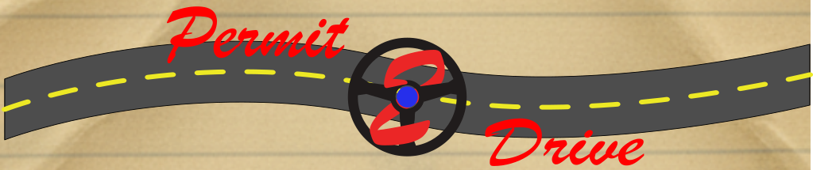
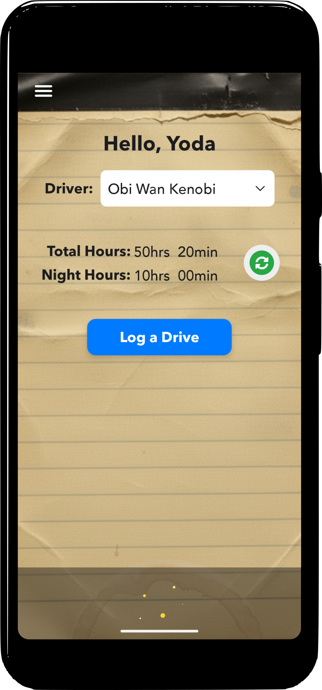
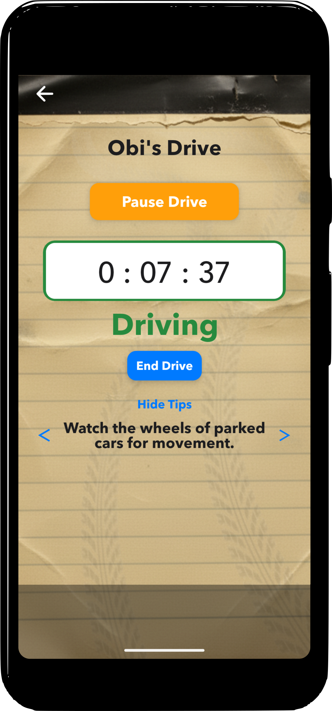
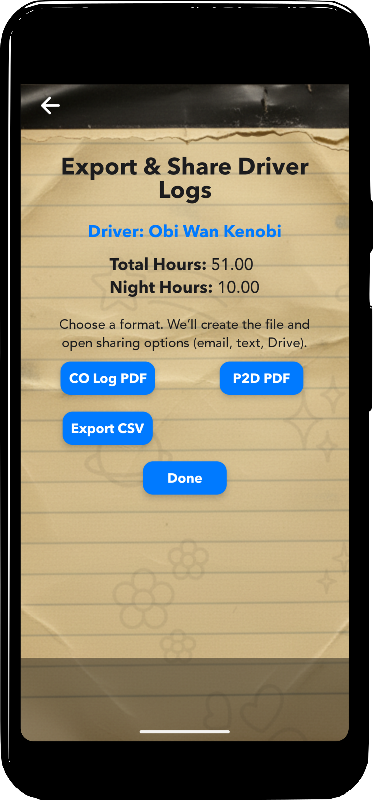

<!-- https://sparkle-ron.github.io/permit2drive-pages/ -->

  

# Permit2Drive

A simple, practical driving log app for supervised driving—built for real families and real schedules.

  <a href="#get-the-app" style="padding:10px 14px; border-radius:10px; background:#111827; color:white; text-decoration:none; font-weight:600;">Get the app</a>
  <a href="#how-it-works" style="padding:10px 14px; border-radius:10px; border:1px solid #e5e7eb; text-decoration:none; font-weight:600;">How it works</a>
  <a href="#privacy" style="padding:10px 14px; border-radius:10px; border:1px solid #e5e7eb; text-decoration:none; font-weight:600;">Privacy</a>

---

## Why Permit2Drive

Learning to drive is stressful enough. Permit2Drive helps you log drives quickly, stay organized, and export clean records when you need them.

  

    
Fast logging

    
Start a drive, record conditions, and save with minimal taps.

  

  

    
Day/Night totals

    
Track progress toward requirements with clear totals.

  

  

    
Export & share

    
Export logs when needed and share with a supervisor or family.

  

  

    
Local-only option

    
Prefer not to sync? Use the app locally.

  

   

    
Your Google Drive

    

      No new accounts. No spam emails. Your driving logs are saved to your own Google Drive and stay under your control.
    

  

  

    
Pause & resume

    

      Pause a drive anytime and resume later—perfect for errands, stops, or long breaks.
    

  

---

## Screenshots

  
  
  

---

## How it works

1. **Choose Local Only** or **Sign in with Google** (optional) for Google Drive sync.  
2. **Start a drive**, set conditions (day/night, notes, etc.), and save.  
3. **Review totals** and **export** when you need a clean record.

---

## Get the app

- **Google Play:** _Coming soon_
- **Internal testing:** If you’re part of the test group, use the invite link you received.

---

## Privacy

Permit2Drive does not create user accounts. If you use Google Drive sync, your logs are saved to **your own Google Drive** and you can delete them at any time.

- **Privacy Policy:** [Privacy Policy](privacy-policy.md)  
- **Support:** Email us at **support@permit2drive.com** (replace with your real support email)

---

## About

Permit2Drive is built to make supervised driving logs simple, accurate, and easy to share.

  © Permit2Drive

- [Privacy Policy](/permit2drive-pages/privacy)
- [Support](/permit2drive-pages/support)
- [Legal](/permit2drive-pages/legal)

