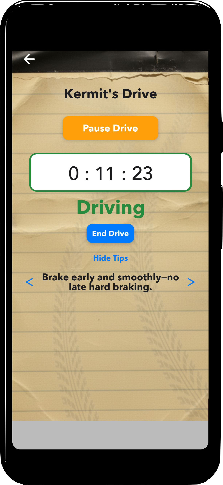
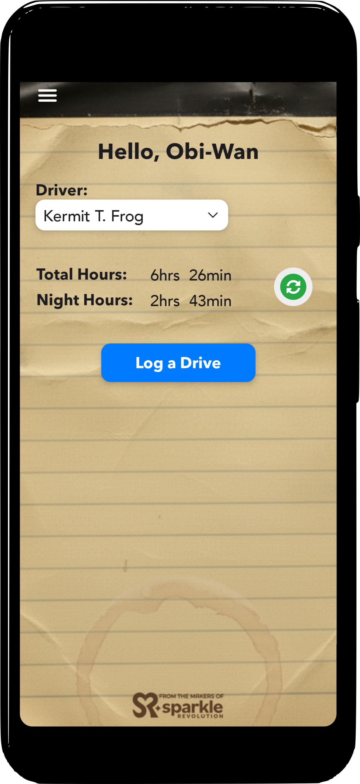
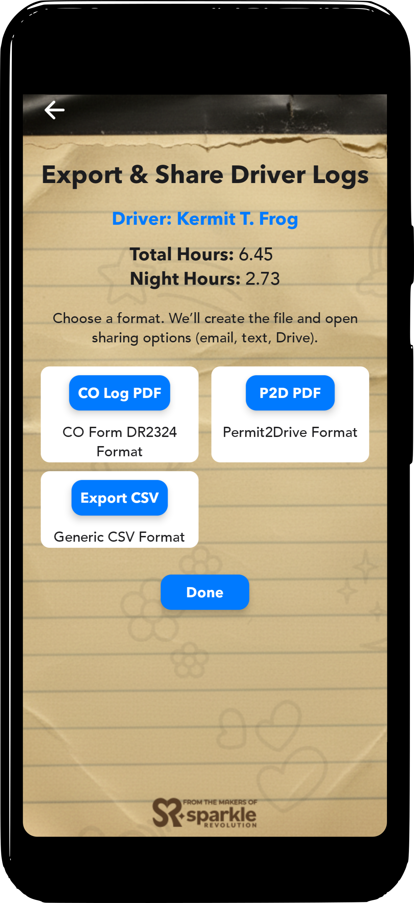
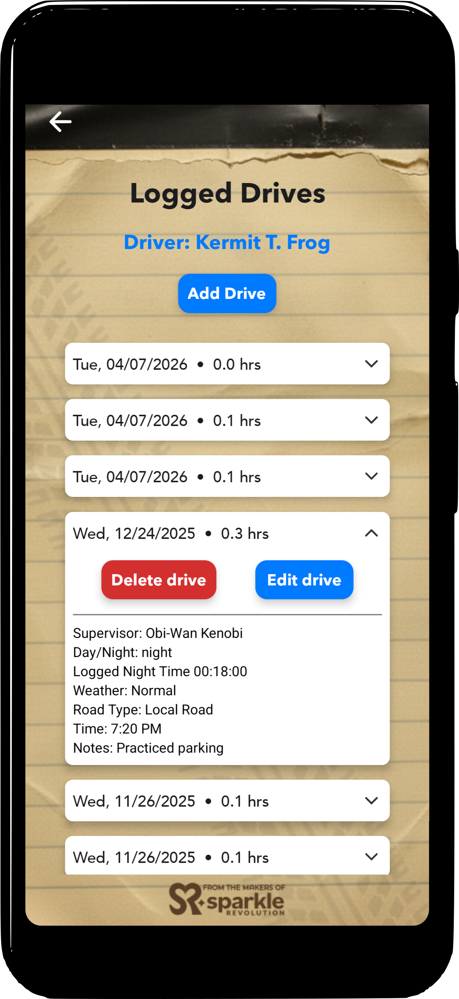

<!-- /index.md -->

  

    

      
Supervised driving made simpler

      <h1>Track drives, stay organized, and export clean records.</h1>

      

        Permit2Drive helps families log supervised driving hours with less friction,
        clearer totals, and export options that are easy to review and share.
      

      

        <a href="#get-the-app" class="button button-primary">Get the app</a>
        <a href="#how-it-works" class="button button-secondary">How it works</a>
        <a href="{{ '/state-requirements' | relative_url }}" class="button button-secondary">State Requirements</a>
      

    

    

      

        
      

    

  

  

    

      

        <h3>Check your state requirements</h3>
        

          Driving log requirements vary by state. See whether Permit2Drive is a
          great fit for your state—and what to watch for.
        

      

      <a href="{{ '/state-requirements' | relative_url }}" class="button button-primary">
        View State Requirements
      </a>
    

  

<!-- Why Permit2Drive Section -->

  <h2>Why Permit2Drive</h2>

  

    Learning to drive is stressful enough. Permit2Drive helps you log drives
    quickly, stay organized, and export clean records when you need them.
  

  

    

      
⏱

      <h3>Fast logging</h3>
      
Start a drive, record conditions, and save with minimal taps.

    

    

      
🌙

      <h3>Day/Night totals</h3>
      
Track progress toward requirements with clear totals.

    

    

      
📤

      <h3>Export &amp; share</h3>
      
Export logs when needed and share with a supervisor or family.

    

    

      
🔄

      <h3>Import from RoadReady</h3>
      

        Already using RoadReady? Bring your existing drives into Permit2Drive and
        continue tracking without starting over.
      

    

    

      
📱

      <h3>Local-only option</h3>
      
Prefer not to sync? Use the app locally.

    

    

      
☁️

      <h3>Your Google Drive</h3>
      

        No new accounts. No spam emails. Your driving logs are saved to your own
        Google Drive and stay under your control.
      

    

    

      
👥

      <h3>Multiple drivers &amp; supervisors</h3>
      

        Track drives for multiple drivers and supervisors in one place—ideal for
        families with more than one learner.
      

    

    

      
⏸

      <h3>Pause &amp; resume</h3>
      

        Pause a drive anytime and resume later—perfect for errands, stops, or
        long breaks.
      

    

  

<!-- Screenshots Section -->
<!-- Screenshots Section -->

  

    <h2>See Permit2Drive in action</h2>
    

      From starting a drive to tracking progress and exporting logs,
      everything is designed to be simple and clear.
    

  

  

    
    
Start a drive in seconds

  

  

    

      
      
See your progress at a glance

    

    

      
      
Export clean logs when you need them

    

    

      
      
Stay organized with a clear drive history

    

  

<!-- How it works section -->

  

    

    <h2>How it works</h2>

    <ol>
      <li>
        <strong>Choose Local Only</strong> or
        <strong>Connect with Google</strong> (optional) for Google Drive sync.
      </li>
      <li>
        <strong>Start a drive</strong>, set conditions (day/night, notes, etc.),
        and save.
      </li>
      <li>
        <strong>Review totals</strong> and <strong>export</strong> when you need
        a clean record.
      </li>
    </ol>

  

  

  

    <h2>Ready to start logging drives?</h2>

    

      Download Permit2Drive and start tracking supervised driving hours today.
    

    

      

      
    

    

      

        Currently in testing. App Store availability coming soon.
      

    

  

  

    <h2>About</h2>

    

      Permit2Drive is built to make supervised driving logs simple, accurate,
      and easy to share.
    

  

